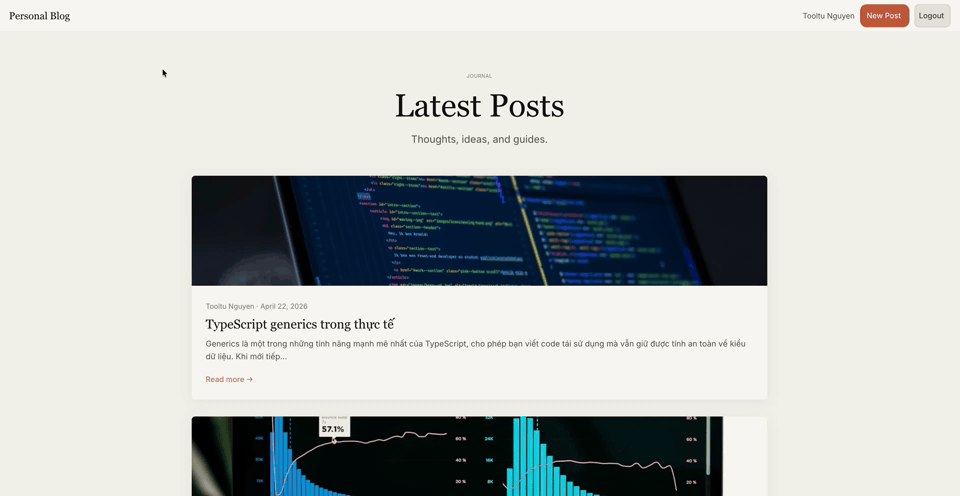
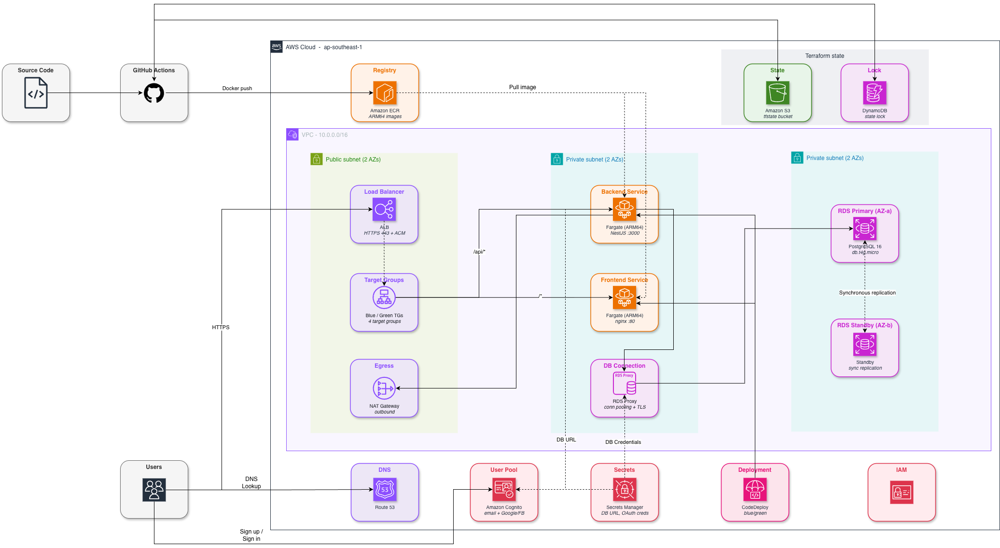

# Personal Blog Platform — AWS ECS Fargate

A full-stack blog platform built with NestJS and React, deployed on AWS ECS Fargate with full CI/CD automation via GitHub Actions and Terraform.

Users can register accounts, write posts (draft or published), and comment on published content. The infrastructure is defined entirely as code and deployed automatically on every push.

---

## Demo

**Short demo**




## Architecture

**Architecture diagram**



```
Internet → ALB (HTTPS :443)
              ├── /api/*  → Backend  (NestJS,  port 3000)  ──┐
              ├── /docs*  → Backend  (Swagger UI)             ├── ECS Fargate (ARM64)
              └── /*      → Frontend (nginx,    port 80)   ──┘
           HTTP :80 → redirect to HTTPS

ECS Tasks (app subnets) → RDS Proxy → RDS PostgreSQL (data subnets, no internet)
```

**Network tiers:**

| Tier | CIDR | Resources |
|------|------|-----------|
| Public | `10.0.1.0/24`, `10.0.2.0/24` | ALB, NAT Gateway |
| App (private) | `10.0.10.0/24`, `10.0.20.0/24` | ECS Fargate tasks, RDS Proxy |
| Data (private) | `10.0.30.0/24`, `10.0.40.0/24` | RDS PostgreSQL (no internet route) |

---

## Tech Stack

**Backend**
- [NestJS 11](https://nestjs.com/) — modular Node.js framework (TypeScript, ESM)
- [Prisma 7](https://www.prisma.io/) — ORM with PostgreSQL adapter + connection pooling
- [Passport.js](http://www.passportjs.org/) + [jwks-rsa](https://github.com/auth0/node-jwks-rsa) — verifies Cognito-issued JWTs against the pool's JWKS endpoint
- [Swagger / OpenAPI](https://swagger.io/) — auto-generated API docs at `/docs`
- Jest — unit & e2e testing

**Frontend**
- [React 19](https://react.dev/) — UI library
- [Vite 8](https://vitejs.dev/) — build tool
- [React Router v7](https://reactrouter.com/) — client-side routing
- [AWS Amplify Auth](https://docs.amplify.aws/) — Cognito client SDK (email/password + Google/Facebook federation)
- React Context — auth state management
- Custom fetch wrapper — API communication

**Infrastructure (AWS)**
- **ECS Fargate** (ARM64/Graviton) — serverless container runtime
- **RDS PostgreSQL 16** — managed relational database (Multi-AZ)
- **RDS Proxy** — connection pooling between ECS and RDS
- **ALB** — HTTPS termination, path-based routing, blue/green traffic shifting
- **ECR** — private container registry (backend + frontend)
- **CodeDeploy** — blue/green deployments with auto-rollback
- **Cognito** — User Pool with hosted domain, App Client for the SPA, Google + Facebook Identity Providers for social login
- **Secrets Manager** — `DATABASE_URL` injected at task start; `google-oauth` and `facebook-oauth` consumed at `terraform apply` time to configure Cognito IdPs
- **ACM** — TLS certificate for `*.tooltu.io.vn`

**IaC & CI/CD**
- [Terraform](https://www.terraform.io/) `>= 1.5` — full infrastructure as code
- GitHub Actions — three automated pipelines
- OIDC federation — keyless AWS authentication from GitHub Actions (no stored credentials)
- S3 + DynamoDB — Terraform remote state + locking

---

## Repository Structure

```
.
├── backend/               # NestJS API
│   ├── src/
│   │   ├── auth/          # Cognito JWT strategy + guards + user provisioning
│   │   ├── users/         # User lookup (records auto-provisioned from Cognito on first auth'd request)
│   │   ├── posts/         # Blog post CRUD + authorization
│   │   ├── comments/      # Comments on published posts
│   │   ├── health/        # Database health check
│   │   └── prisma/        # Global PrismaService
│   ├── prisma/            # Schema, migrations, config
│   └── Dockerfile         # Multi-stage ARM64 build
│
├── frontend/              # React + Vite SPA
│   ├── src/
│   │   ├── pages/         # Home, Login, Register, AuthCallback, PostDetail, PostForm
│   │   ├── components/    # Navbar, PostCard, CommentSection
│   │   ├── context/       # AuthContext (wraps Amplify Auth; no manual token storage)
│   │   ├── lib/           # amplify.ts — Amplify.configure for Cognito pool + OAuth
│   │   └── api/           # Typed fetch wrappers (inject Cognito access token per request)
│   ├── nginx.conf         # SPA fallback + /health endpoint
│   └── Dockerfile         # Multi-stage nginx build
│
├── infra/                 # Terraform
│   ├── main.tf            # Root module + S3 backend
│   └── modules/
│       ├── networking/    # VPC, subnets, NAT, security groups
│       ├── ecr/           # Container registries + lifecycle policies
│       ├── rds/           # RDS instance, RDS Proxy, IAM
│       ├── secrets/       # Secrets Manager entries (database URL + OAuth creds)
│       ├── cognito/       # User Pool, hosted domain, App Client, Google/Facebook IdPs
│       ├── alb/           # Load balancer, listeners, target groups
│       ├── ecs/           # Cluster, task definitions, services
│       └── codedeploy/    # Deployment app + deployment groups
│
└── .github/workflows/
    ├── terraform.yml       # Plan on PR, apply on merge
    ├── deploy-backend.yml  # Build → migrate → deploy backend
    └── deploy-frontend.yml # Build → deploy frontend
```

---

## CI/CD Workflow

Every push to `main` triggers the relevant pipeline automatically. No manual steps are needed after the initial infrastructure setup.

```
Push to infra/**   →  terraform.yml
                        terraform plan  (on PR → posted as comment)
                        terraform apply (on merge to main)

Push to backend/** →  deploy-backend.yml
                        1. Run unit tests (with Prisma generate)
                        2. Build Docker image → push to ECR
                        3. Run Prisma migrations (one-off ECS task)
                        4. Register new ECS task definition
                        5. CodeDeploy blue/green deployment

Push to frontend/** → deploy-frontend.yml
                        1. Build Docker image (VITE_API_URL baked in)
                        2. Push to ECR
                        3. Register new ECS task definition
                        4. CodeDeploy blue/green deployment
```

Authentication between GitHub Actions and AWS uses **OIDC** — no AWS access keys are stored in GitHub secrets.

---

## Prerequisites

Before deploying, you need:

- AWS account with a **payment method on file** (required for CodeDeploy, RDS Proxy, and other services beyond free tier)
- AWS CLI configured locally (`aws configure`)
- Terraform `1.14.3` installed locally
- A registered domain with a wildcard ACM certificate (`*.yourdomain.com`) in `ap-southeast-1`
- A GitHub repository with Actions enabled
- **Google OAuth 2.0 client** (Google Cloud Console → APIs & Services → Credentials, type: Web application)
- **Facebook App** with Facebook Login product enabled (Meta for Developers)

Both OAuth apps need the redirect URI `https://<cognito-domain-prefix>.auth.ap-southeast-1.amazoncognito.com/oauth2/idpresponse` — the Cognito hosted domain is created by Terraform, so you'll configure it after the first partial apply (see step 3).

---

## Deployment Guide

### 1. One-time Bootstrap (run locally)

**Create GitHub Actions IAM role (OIDC)**

```bash
# Create OIDC provider
aws iam create-open-id-connect-provider \
  --url https://token.actions.githubusercontent.com \
  --client-id-list sts.amazonaws.com \
  --thumbprint-list 6938fd4d98bab03faadb97b34396831e3780aea1

# Create role + trust policy (replace YOUR_GITHUB_USERNAME and ACCOUNT_ID)
# See docs/aws-console-deploy-guide.md for the full policy document
aws iam create-role \
  --role-name github-actions-blog \
  --assume-role-policy-document file://github-trust-policy.json
```

The role needs permissions for: ECR push, ECS (run-task, register-task-definition), CodeDeploy (create-deployment), Terraform provisioning (EC2, RDS, ALB, IAM, etc.), and S3/DynamoDB for Terraform state.

**Create Terraform remote state backend**

```bash
ACCOUNT_ID=$(aws sts get-caller-identity --query Account --output text)

aws s3api create-bucket \
  --bucket blog-terraform-state-$ACCOUNT_ID \
  --region ap-southeast-1 \
  --create-bucket-configuration LocationConstraint=ap-southeast-1

aws s3api put-bucket-versioning \
  --bucket blog-terraform-state-$ACCOUNT_ID \
  --versioning-configuration Status=Enabled

aws dynamodb create-table \
  --table-name terraform-lock \
  --region ap-southeast-1 \
  --attribute-definitions AttributeName=LockID,AttributeType=S \
  --key-schema AttributeName=LockID,KeyType=HASH \
  --billing-mode PAY_PER_REQUEST
```

Then update `infra/main.tf` — replace `ACCOUNT_ID` in the `backend "s3"` block with your real account ID.

### 2. Configure GitHub Secrets & Variables

Go to **GitHub → Repository → Settings → Secrets and variables → Actions**

**Secrets:**

| Name | Value |
|------|-------|
| `AWS_ROLE_ARN` | ARN of the `github-actions-blog` IAM role |
| `AWS_ACCOUNT_ID` | Your 12-digit AWS account ID |
| `ACM_CERTIFICATE_ARN` | ARN of your wildcard ACM cert (`*.yourdomain.com`) |

**Variables:**

| Name | Value |
|------|-------|
| `DOMAIN_NAME` | Your domain, e.g. `blog.yourdomain.com` |

### 3. Deploy Infrastructure

The Cognito module reads the Google/Facebook OAuth secrets at plan time, so the order matters on the first apply:

**3a. Create the secrets (targeted apply):**

```bash
cd infra
terraform init
terraform apply -target=module.secrets
```

This creates `blog-dev/google-oauth` and `blog-dev/facebook-oauth` with `REPLACE_ME` placeholders.

**3b. Populate the OAuth secrets** via the AWS console (Secrets Manager):

- `blog-dev/google-oauth` → `{"client_id":"...","client_secret":"..."}`
- `blog-dev/facebook-oauth` → `{"app_id":"...","app_secret":"..."}`

The `secrets` module has `lifecycle { ignore_changes = [secret_string] }`, so Terraform will not overwrite these on future applies.

**3c. Full apply:**

```bash
git add infra/
git commit -m "feat: initial infrastructure"
git push origin main
```

GitHub Actions runs `terraform apply` and provisions the full environment — VPC, RDS, ALB, ECS cluster, ECR repos, CodeDeploy, Cognito (User Pool + hosted domain + Google/Facebook IdPs), and Secrets Manager entries.

**3d. Finalize OAuth apps.** Grab the Cognito hosted domain from `terraform output cognito_user_pool_domain`, then add `https://<domain>/oauth2/idpresponse` as the authorized redirect URI in both the Google OAuth client and the Facebook app.

### 4. Deploy Applications

After infrastructure is ready, push to `backend/` and `frontend/` to trigger their deploy pipelines. The pipelines build Docker images (ARM64), push to ECR, run migrations (backend only), and perform a blue/green deployment via CodeDeploy.

### 5. Configure DNS

After the ALB is created, find its DNS name:

```bash
cd infra && terraform output alb_dns_name
```

Create a **CNAME record** in your DNS provider:
```
blog.yourdomain.com → <alb-dns-name>.ap-southeast-1.elb.amazonaws.com
```

### 6. Local Development

```bash
# Backend
cd backend
cp .env.example .env      # fill in DATABASE_URL + COGNITO_REGION / COGNITO_USER_POOL_ID / COGNITO_CLIENT_ID
npm install
npx prisma generate
npm run start:dev          # http://localhost:3000
                           # Swagger at http://localhost:3000/docs

# Frontend (separate terminal)
cd frontend
cp .env.example .env      # VITE_API_URL + VITE_COGNITO_USER_POOL_ID / VITE_COGNITO_CLIENT_ID / VITE_COGNITO_DOMAIN
npm install
npm run dev               # http://localhost:5173
```

---

## Known Issues & Gotchas

### ECR repos must exist before first image push

The `deploy-backend.yml` and `deploy-frontend.yml` workflows push to ECR repos that are created by Terraform. Run the `terraform.yml` workflow (or `terraform apply` locally) **before** triggering the deploy workflows for the first time.

### Terraform state is lost on ephemeral CI runners

If the S3 backend is not bootstrapped, Terraform state is stored on the runner's local disk and **discarded after every job**. The next run treats all resources as new, causing duplicate creation errors. Always bootstrap the S3 backend before using CI for Terraform.

### Terraform version must match between local and CI

`terraform fmt` output changes between versions. A formatting difference between your local Terraform version and the version installed by CI causes `fmt -check` to fail. The CI workflow pins version `1.14.3` — keep your local installation in sync.

### Prisma client must be generated before running tests

`npm ci` installs packages but does not run `prisma generate`. Tests that import from `.prisma/client` will fail with `Cannot find module`. Always run `npx prisma generate` before `npm test`, both locally and in CI.

### RDS password may contain special characters

RDS-managed credentials (Secrets Manager) can include characters like `#`, `*`, `~`. These break the `DATABASE_URL` connection string if not URL-encoded (e.g. `#` → `%23`). The Terraform `secrets` module handles this with `urlencode()`.

### RDS SSL requires `uselibpqcompat=true`

RDS enforces SSL. The Node.js `pg` driver v8+ upgrades `sslmode=require` to `verify-full`, which rejects RDS's CA cert. The fix is to append `?sslmode=require&uselibpqcompat=true` to the connection string — this encrypts the connection without verifying the CA (safe inside a VPC).

### Frontend `VITE_API_URL` is baked in at build time

Vite bundles the API URL into the JavaScript at build time. The image is **environment-specific** — there is no way to change the API URL at runtime without rebuilding. A separate Docker build is needed per environment.

### ECS does not reload secrets at runtime

ECS reads Secrets Manager values only when a new task starts. After rotating or updating a secret, force a new deployment: **ECS → Service → Update → Force new deployment**.

### Cognito OAuth secrets must be populated before the full Terraform apply

The `cognito` module reads `blog-dev/google-oauth` and `blog-dev/facebook-oauth` at plan time via `data "aws_secretsmanager_secret_version"`. A full apply fails on a fresh environment unless you first run `terraform apply -target=module.secrets`, populate the JSON values in the console, then run the full apply. After that, `lifecycle { ignore_changes = [secret_string] }` keeps your values safe across future applies.


---

## API Reference

Swagger UI is available at `https://yourdomain.com/docs` after deployment, or at `http://localhost:3000/docs` locally.

**Main endpoints:**

| Method | Path | Auth | Description |
|--------|------|------|-------------|
| `GET` | `/api/posts` | — | List published posts |
| `POST` | `/api/posts` | Cognito | Create post (DRAFT) |
| `PATCH` | `/api/posts/:id` | Cognito | Update post (author/admin) |
| `DELETE` | `/api/posts/:id` | Cognito | Delete post (author/admin) |
| `GET` | `/api/comments?postId=` | — | List comments |
| `POST` | `/api/comments` | Cognito | Add comment |
| `DELETE` | `/api/comments/:id` | Cognito | Delete comment (author/admin) |
| `GET` | `/api/health` | — | Database health check |

Authentication is handled entirely by Cognito — there are no `/api/auth/register` or `/api/auth/login` endpoints. The SPA signs users in via Amplify (email/password or Google/Facebook), then sends the Cognito access token as `Authorization: Bearer <jwt>` on protected requests. The backend verifies the token against the pool's JWKS, then upserts a local `User` row keyed by `cognitoSub` on the first authenticated request.

---

## Cost

Approximate monthly cost in `ap-southeast-1`, on-demand:

| Service | Monthly |
|---------|---------|
| NAT Gateway (1 instance) | $43 |
| RDS Multi-AZ `db.t4g.micro` + 20GB gp3 | $36 |
| RDS Proxy (2 vCPU source) | $22 |
| ALB + LCU | $21 |
| ECS Fargate ARM64 (2 tasks × 0.25 vCPU / 0.5 GB) | $14 |
| Cognito User Pool (< 50k MAU) | Free |
| Secrets Manager (3 secrets), ECR, CloudWatch, S3/DynamoDB | ~$4 |
| **Total** | **~$140 / month** |

NAT Gateway + RDS Multi-AZ + RDS Proxy dominate (~61% of the bill). This project prioritizes production patterns over cost, but if you want a cheaper variant:

- Single-AZ RDS → −$18/mo
- VPC Endpoints instead of NAT Gateway → −$16/mo net
- Drop RDS Proxy → −$22/mo
- Fargate Spot → −$9/mo
- **Combined optimized target: ~$60/month**

---

## License

MIT
